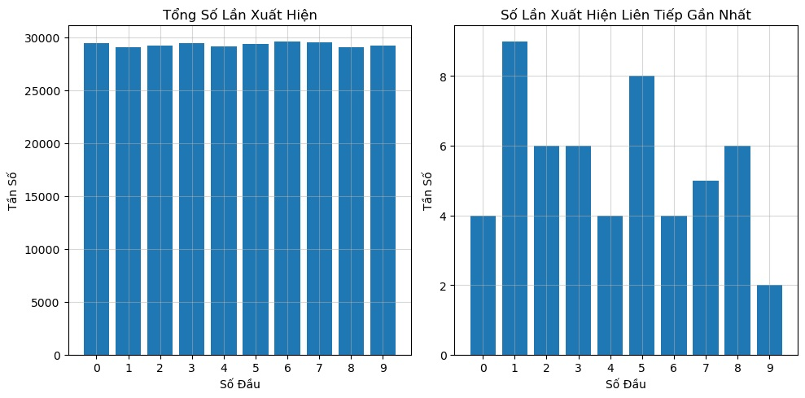

# LOTTERY
Phân tích dữ liệu xổ số kiến thiết giúp dự đoán lô đề dựa trên mô hình machine learning.

## HÌNH ẢNH DEMO
<p align='center'>
</img>
</p>

## CODE DEMO
```python
# Xây dựng mô hình LSTM
model = Sequential()
model.add(LSTM(50, input_shape=(X_train_reshaped.shape[1], X_train_reshaped.shape[2])))
model.add(Dense(10))
model.compile(loss='mse', optimizer='adam')
```
