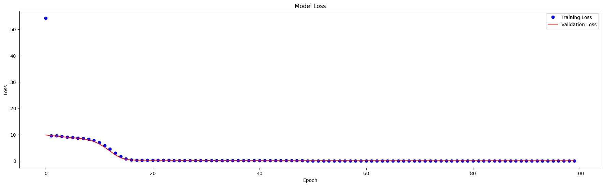

# LOTTERY
Phân tích dữ liệu xổ số kiến thiết giúp dự đoán lô đề dựa trên mô hình machine learning.

## HÌNH ẢNH DEMO
<p align='center'>
</img>
</p>

## CODE DEMO
```python
# Linear Regression
def lin_reg(df, ip_col_name_cnt, ip_col_name_cons, op_col_name):
    # prepare data for training
    X = df[[ip_col_name_cnt, ip_col_name_cons]]
    y = df[op_col_name]
    # train Linear Regression model
    model = LinearRegression()
    model.fit(X, y)
    # predict the next number in the sequence
    return int(round(model.predict(X.tail(1))[0]))
```

### TÍCH HỢP
</img>
<div style='display:flex;'>

- Matplotlib » 3.5.2

</div>
</img>
<div style='display:flex;'>

- NumPy » 1.21.5

</div>
</img>
<div style='display:flex;'>

- Pandas » 1.4.4

</div>
</img>
<div style='display:flex;'>

- Pandas » 1.0.2

</div>